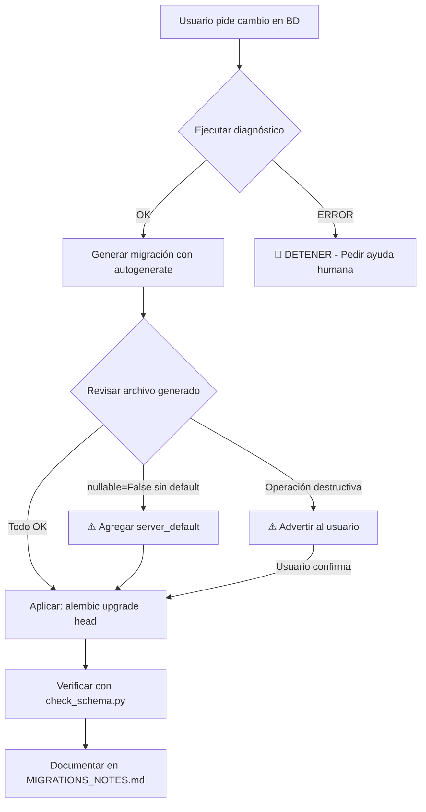

# Database Migrations Skill

Esta skill guía al agente a través del proceso **obligatorio** para modificar la estructura de la base de datos. El objetivo es prevenir inconsistencias ("multiple heads"), pérdida de datos o bloqueos en producción.

## 🚨 When to use this skill (Cuándo usar)

* Cuando el usuario pida "crear una migración", "actualizar la BD" o "modificar un modelo" en `db/models.py`.
* Cuando se detecten errores de SQLAlchemy relacionados con columnas faltantes o tablas inexistentes.
* Antes de hacer commit de cambios que afecten a `db/models.py`.

## 🛠️ How to use it (Flujo de Trabajo)

El agente debe seguir este orden estricto. Si un paso falla, **DETENERSE** y pedir intervención humana.

### Paso 1: Diagnóstico Previo (Safety Check)

Antes de tocar nada, verifica el estado actual:

1. Ejecuta: `python scripts/debug_migrations.py`
   * *Objetivo:* Verificar que no existan "multiple heads" en Alembic.

2. Ejecuta: `python scripts/check_schema.py`
   * *Objetivo:* Verificar si el esquema actual coincide con los modelos (drift detection).

> [!CAUTION]
> Si alguno de estos scripts reporta errores, **NO CONTINUAR**. Solicita intervención humana para resolver el conflicto antes de generar nuevas migraciones.

### Paso 2: Generación de la Migración

Si el diagnóstico es verde (OK), procede a generar el script:

```bash
alembic revision --autogenerate -m "<descripción_breve_del_cambio>"
```

* *Nota:* Usa una descripción en español, clara y concisa (ej: `"agrega_columna_stock_a_productos"`).

### Paso 3: Validación de Código (Review)

> [!IMPORTANT]
> **CRÍTICO:** El agente debe leer el archivo generado en `db/migrations/versions/` y verificar:

| Verificación | Acción Requerida |
|--------------|------------------|
| ¿Hay columnas `nullable=False`? | Asegurarse de que tengan un `server_default` o que la tabla esté vacía |
| ¿El `downgrade()` revierte lo que hace el `upgrade()`? | Confirmar que la reversión es correcta |
| ¿Hay operaciones destructivas (`drop_column`, `drop_table`)? | Advertir al usuario sobre posible pérdida de datos |

### Paso 4: Aplicación y Documentación

1. **Aplica los cambios:**
   ```bash
   alembic upgrade head
   ```

2. **Verifica integridad post-migración:**
   ```bash
   python scripts/audit_schema.py  # si existe
   # o alternativamente:
   python scripts/check_schema.py
   ```

3. **Acción Documental:** Agrega una nueva entrada en `docs/MIGRATIONS_NOTES.md` con:
   * Fecha
   * ID de la revisión
   * Breve explicación del cambio

---

## 💡 Comandos Útiles (Referencia)

| Acción | Comando |
|:-------|:--------|
| Ver historial | `alembic history` |
| Ver revisión actual | `alembic current` |
| Bajar una versión | `alembic downgrade -1` |
| Estado detallado | `python scripts/db_diag.py` |
| Verificar heads | `alembic heads` |
| Merge de branches | `alembic merge heads -m "merge_branches"` |

---

## 🔄 Árbol de Decisión


