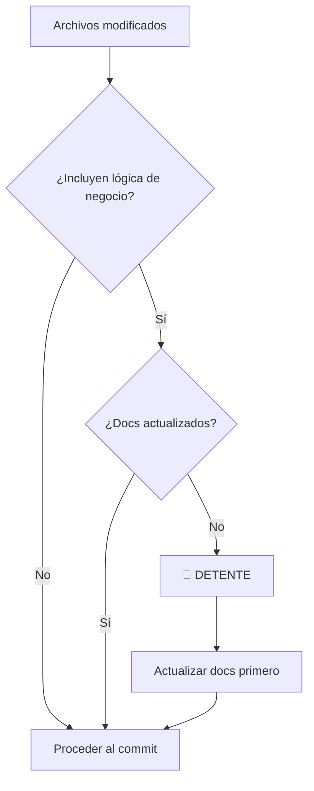

# Smart Git Commit & Push Skill

Esta skill asegura que ningún código suba al repositorio sin su documentación correspondiente y con un historial de cambios claro.

## 🚨 When to use this skill

* Cuando el usuario diga "sube los cambios", "haz un commit", "actualiza el repo" o "pushea".
* Al finalizar una tarea de codificación importante.
* Cuando se detecten múltiples archivos modificados pendientes de commit.

## 🛠️ How to use it (Flujo de Trabajo Estricto)

El agente debe ejecutar estos pasos en orden secuencial. **NO saltar pasos.**

---

### Paso 1: Análisis de Estado (Status Check)

1. Ejecuta `git status` para ver archivos modificados.
2. Ejecuta `git diff --stat` para ver la magnitud de los cambios.
3. **Acción de Limpieza:** Si ves archivos de logs, temporales o `__pycache__` que no deberían estar, sugiere agregarlos al `.gitignore` o elimínalos antes de proceder.

> [!TIP]
> Usa `git diff --name-only` para obtener una lista limpia de archivos modificados para análisis.

---

### Paso 2: Validación de Documentación (CRÍTICO) 🛑

Antes de crear el commit, analiza los archivos modificados:

| Tipo de Cambio | Acción Requerida |
|----------------|------------------|
| **Lógica de negocio** (`services/`, `core/`) | Verificar docs relacionados en `docs/` |
| **Nuevos endpoints** (`routers/`) | Actualizar documentación de API |
| **Cambios en modelos** (`db/models.py`) | Verificar `docs/MODELS.md` o similar |
| **Nueva feature** | Crear entrada en `docs/` si aplica |

**Árbol de decisión:**



> [!CAUTION]
> **NUNCA** hacer commit de código sin verificar que la documentación esté sincronizada. Código sin documentar es deuda técnica inmediata.

---

### Paso 3: Generación del Commit

1. **Formato:** Usa **Conventional Commits**:

   | Prefijo | Uso |
   |---------|-----|
   | `feat:` | Nueva funcionalidad |
   | `fix:` | Corrección de bug |
   | `docs:` | Solo documentación |
   | `style:` | Formateo, sin cambio de lógica |
   | `refactor:` | Refactorización de código |
   | `test:` | Agregar o modificar tests |
   | `chore:` | Tareas de mantenimiento |

2. **Mensaje:** Genera una descripción detallada basada en el `git diff`. 
   - ❌ NO uses mensajes genéricos como "update code" o "fix bug"
   - ✅ Explica el *por qué* del cambio

3. **Ejecución:**
   ```bash
   git add .  # o archivos específicos
   git commit -m "tipo(scope): Título corto" -m "Descripción detallada de los cambios..."
   ```

**Ejemplo de buen commit:**
```bash
git commit -m "feat(products): agregar campo stock_minimo al modelo" -m "
- Añade columna stock_minimo para alertas de inventario bajo
- Incluye migración de Alembic con valor default 0
- Actualiza ProductSchema para exponer el nuevo campo
"
```

---

### Paso 4: Sincronización (Push)

1. **(Recomendado)** Sincroniza cambios remotos primero:
   ```bash
   git pull --rebase origin <rama_actual>
   ```

2. **Push:**
   ```bash
   git push origin <rama_actual>
   ```

> [!NOTE]
> Si hay conflictos durante el rebase, **DETENERSE** y pedir intervención humana.

---

## ⚠️ Reglas de Oro

1. **Documentación Primero:** Código sin documentar es deuda técnica inmediata. Si tocas código, tocas docs.

2. **Commits Atómicos:** Si hay cambios de *features* diferentes, sugiere hacer commits separados en lugar de uno gigante.

3. **Mensajes Descriptivos:** El historial de Git es documentación viva. Cada commit debe explicar *qué* y *por qué*.

4. **No Forzar Push:** Nunca usar `git push --force` sin autorización explícita del usuario.

---

## 💡 Comandos de Referencia

| Acción | Comando |
|:-------|:--------|
| Ver cambios detallados | `git diff` |
| Ver historial reciente | `git log --oneline -10` |
| Deshacer último commit (mantener cambios) | `git reset --soft HEAD~1` |
| Ver rama actual | `git branch --show-current` |
| Stash temporal | `git stash` |
| Recuperar stash | `git stash pop` |
