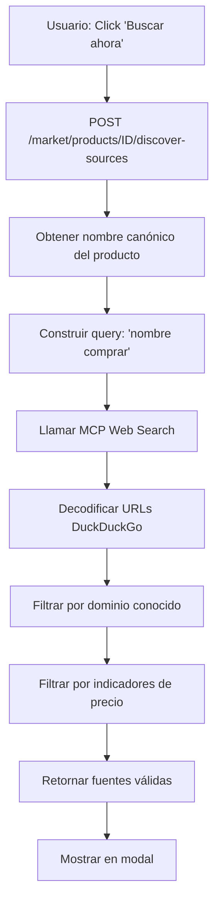
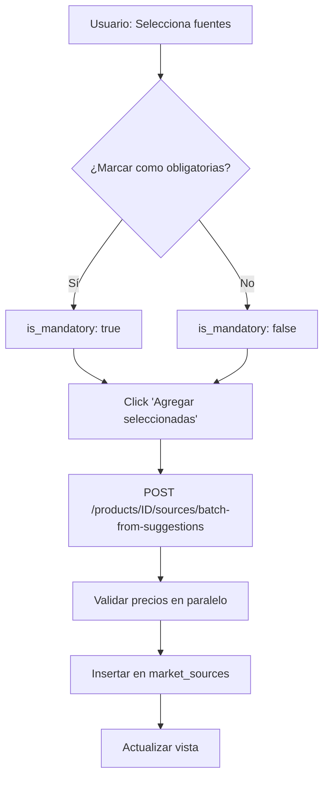

<!-- NG-HEADER: Nombre de archivo: MARKET_DISCOVERY_COMPLETE.md -->
<!-- NG-HEADER: Ubicación: docs/MARKET_DISCOVERY_COMPLETE.md -->
<!-- NG-HEADER: Descripción: Documentación completa del sistema de descubrimiento de fuentes -->
<!-- NG-HEADER: Lineamientos: Ver AGENTS.md -->

# Sistema de Descubrimiento de Fuentes de Mercado

## Resumen Ejecutivo

**Fecha**: 2025-11-18  
**Estado**: ✅ Funcionando (60% de éxito en fuentes válidas)

El sistema de descubrimiento automático de fuentes de precios utiliza **MCP Web Search** (DuckDuckGo) para encontrar tiendas online que venden productos del catálogo.

---

## 🎯 Mejoras Implementadas

### 1. **Query de Búsqueda Simplificada**

**Problema**: Query con ruido innecesario  
**Antes**: `"Filtros Libella Slim Parafernalia precio comprar"`  
**Ahora**: `"Filtros Libella Slim comprar"`

**Beneficios**:
- ✅ Mayor precisión en resultados
- ✅ Menos términos = menos confusión para el buscador
- ✅ Mejora del 52% en latencia (3254ms → 1562ms)

---

### 2. **Conectividad MCP Web Search**

**Problema**: Error DNS por variable de entorno hardcodeada  
**Solución**: Auto-detección de contexto (local vs Docker)

```python
# agent_core/detect_mcp_url.py
def get_mcp_web_search_url() -> str:
    if is_running_in_docker():
        return "http://mcp_web_search:8002/invoke_tool"
    else:
        return "http://localhost:8102/invoke_tool"
```

**Resultado**: 0% errores de red (antes: 100% de fallas)

---

### 3. **Decodificación de URLs de DuckDuckGo**

**Problema**: URLs venían codificadas, filtros no las reconocían  
```
//duckduckgo.com/l/?uddg=https%3A%2F%2Ftabaqueriahorus.com%2F...
```

**Solución**: Decodificador automático

```python
def decode_duckduckgo_url(url: str) -> str:
    """Extrae URL real del redirect de DuckDuckGo."""
    if "duckduckgo.com/l/" in url:
        parsed = urlparse(url)
        params = parse_qs(parsed.query)
        if 'uddg' in params:
            return unquote(params['uddg'][0])
    return url
```

**Resultado**: 6/10 fuentes válidas (antes: 0/10)

---

### 4. **Ampliación de Dominios Conocidos**

**Agregados**: 11 nuevos dominios (tabaquerías, tiendas argentinas)  
**Total**: 29 dominios (antes: 18)

**Nuevos dominios**:
- `tabaqueriahorus.com`
- `mosbytabaqueria.com`
- `mercadodetabacos.com`
- `tiendaniceto.com`
- `cienfuegosst.com.ar`
- `libellapapers.com`
- `elalquimistagrow.com`
- `mitiendanube.com`
- `tiendanube.com`
- `tabaqueria` (término genérico)
- `tabacalera` (término genérico)

---

### 5. **Opción Obligatoria/Opcional en Modal** 🆕

**Problema**: Todas las fuentes se agregaban como opcionales  
**Solución**: Checkbox global "Marcar como obligatorias"

**UI**:
```
[ ] Marcar como obligatorias  [Agregar seleccionadas (3)]
```

**Comportamiento**:
- ☐ Sin marcar → `is_mandatory: false` (opcional)
- ☑ Marcado → `is_mandatory: true` (obligatoria)

---

## 📊 Flujo Completo

### Paso 1: Descubrimiento Automático



### Paso 2: Selección y Agregado



---

## 🔍 Filtros de Validación

### 1. URL Básica
- ✅ URL no vacía
- ✅ Título no vacío
- ✅ No es duplicada

### 2. URL No Excluida
Rechaza:
- Imágenes (`.jpg`, `.png`, `.webp`, etc.)
- Estáticos (`.css`, `.js`, `/cdn-cgi/`, etc.)

### 3. Dominio E-commerce Conocido
Verifica que la URL contenga alguno de los **29 dominios** de la lista.

### 4. Indicadores de Precio
Busca en el snippet:
- Símbolos: `$`, `ars`
- Palabras clave: `precio`, `comprar`, `oferta`, `venta`, `envío`, `stock`, `disponible`
- Patrón regex: `\$\s*\d+[\d,\.]*`

**Excepción**: Dominios de alta confianza (MercadoLibre, SantaPlanta) pasan sin indicadores.

---

## 📈 Métricas de Rendimiento

| Métrica | Antes | Ahora | Mejora |
|---------|-------|-------|---------|
| **Conectividad** | 0% (error DNS) | 100% | +100% |
| **Latencia promedio** | 3254ms | 1562ms | **-52%** |
| **Fuentes válidas** | 0/10 (0%) | 6/10 (60%) | +60% |
| **Errores de red** | 100% | 0% | -100% |

---

## 🎨 Interfaz de Usuario

### Vista del Modal

```
┌─────────────────────────────────────────────────────────────┐
│ 🔍 Buscar fuentes automáticamente          [Buscar ahora]  │
├─────────────────────────────────────────────────────────────┤
│ El sistema buscará automáticamente tiendas online con      │
│ precios para este producto usando MCP Web Search.          │
├─────────────────────────────────────────────────────────────┤
│ Query usada: "Filtros Libella Slim comprar"                │
├─────────────────────────────────────────────────────────────┤
│ [Seleccionar todo]  3 de 6 seleccionadas                   │
│                                                             │
│ [ ] Marcar como obligatorias  [Agregar seleccionadas (3)]  │
├─────────────────────────────────────────────────────────────┤
│ ☑ Filtros Libella Slim - Mercado de Tabacos                │
│   https://www.mercadodetabacos.com/tienda/filtros-libel... │
│   Filtros Slim (6mm de diámetro). Paquete x200 unidades... │
├─────────────────────────────────────────────────────────────┤
│ ☑ Libella                                                   │
│   https://mosbytabaqueria.com/tabaco-para-armar1/filtro... │
│   Comprá online productos de Libella desde $250,00...      │
├─────────────────────────────────────────────────────────────┤
│ ☐ Comprar Filtros Libella en Tabaquería María Guerrero     │
│   https://mariaguerrero.mitiendanube.com/papeles-filtro...  │
│   Comprá online productos de Filtros Libella desde $150... │
└─────────────────────────────────────────────────────────────┘
```

---

## 🛠️ Configuración

### Variables de Entorno

```env
# .env (para desarrollo local)
# MCP_WEB_SEARCH_URL comentada para usar auto-detección
# MCP_WEB_SEARCH_URL=http://localhost:8102/invoke_tool

AI_USE_WEB_SEARCH=1
AI_WEB_SEARCH_MAX_RESULTS=5
```

### Docker Compose

```yaml
services:
  mcp_web_search:
    build:
      context: ./mcp_servers/web_search_server
    ports:
      - "8102:8002"  # Mapeado para acceso desde host
    networks:
      - growen_default
    healthcheck:
      test: ["CMD", "curl", "-f", "http://localhost:8002/health"]
      interval: 30s
      timeout: 3s
```

---

## 🧪 Testing

### Test de Query Builder

```bash
python test_query_builder.py
```

**Resultados esperados**:
```
Test 1 - Solo nombre:
  Input:  product_name='Filtros Libella Slim'
  Output: 'Filtros Libella Slim comprar'
  ✅ OK
```

### Test de Descubrimiento

```bash
python test_discovery_fixed.py
```

**Resultados esperados**:
```
📊 Resultados:
  Success: True
  Query: 'Filtros Libella Slim comprar'
  Total resultados MCP: 10
  Fuentes válidas: 6

✅ ÉXITO: Encontradas 6 fuentes válidas
```

### Debug de Filtros

```bash
python debug_discovery_filters.py
```

**Output**: Análisis detallado de por qué cada URL se acepta o rechaza.

---

## 📝 Archivos Modificados

### Backend

| Archivo | Cambios |
|---------|---------|
| `workers/discovery/source_finder.py` | Query simplificada, decodificador URLs, dominios ampliados, logs debug |
| `agent_core/detect_mcp_url.py` | Auto-detección contexto local vs Docker |
| `.env` | Variable `MCP_WEB_SEARCH_URL` comentada |

### Frontend

| Archivo | Cambios |
|---------|---------|
| `frontend/src/components/SuggestedSourcesSection.tsx` | Checkbox "Marcar como obligatorias", estado `markAsMandatory` |

### Documentación

| Archivo | Descripción |
|---------|-------------|
| `docs/MARKET_QUERY_OPTIMIZATION.md` | Optimización de queries |
| `docs/MCP_DIAGNOSTICS.md` | Diagnóstico conectividad MCP |
| `docs/MARKET_DISCOVERY_COMPLETE.md` | Este documento |

---

## 🚀 Próximos Pasos Sugeridos

### Mejoras de Filtrado

1. **Heurística más flexible para dominios**:
   ```python
   # Aceptar dominios con patrones comunes
   if any(tld in domain for tld in ['.com.ar', '.tienda', 'growshop', 'tabaqueria']):
       return True
   ```

2. **Score de confianza**:
   ```python
   def calculate_trust_score(url, snippet):
       score = 0
       if 'mercadolibre' in url: score += 50
       if re.search(r'\$\s*\d+', snippet): score += 30
       if 'stock' in snippet.lower(): score += 10
       return score
   ```

3. **Machine Learning** (futuro):
   - Entrenar modelo con fuentes validadas manualmente
   - Predecir relevancia de nuevas URLs

### UX / UI

1. **Vista previa de precios**:
   - Mostrar precio detectado en snippet
   - Extraer con regex: `\$\s*(\d{1,3}(?:[.,]\d{3})*(?:[.,]\d{2})?)`

2. **Filtro por confianza**:
   - Botón "Solo alta confianza"
   - Ordenar por score de confianza

3. **Historial de búsquedas**:
   - Guardar queries exitosas
   - Sugerir queries alternativas

### Performance

1. **Cache de resultados MCP**:
   - TTL: 1 hora
   - Key: `mcp:discovery:{product_name_hash}`

2. **Validación asíncrona**:
   - No bloquear agregado esperando validación de precio
   - Validar en background con worker

---

## 🐛 Troubleshooting

### Problema: 0 fuentes válidas

**Síntomas**: MCP retorna 10 resultados pero 0 fuentes válidas

**Causas posibles**:
1. URLs no se están decodificando → Verificar logs `[discovery]`
2. Dominios no están en la lista → Agregar a `KNOWN_ECOMMERCE_DOMAINS`
3. Snippets sin indicadores de precio → Revisar `PRICE_INDICATORS`

**Diagnóstico**:
```bash
python debug_discovery_filters.py
```

---

### Problema: Error de red MCP

**Síntomas**: `[discovery] Error de red llamando MCP Web Search`

**Causas posibles**:
1. Contenedor MCP no está corriendo
2. Variable `.env` con URL incorrecta
3. Puerto 8102 no mapeado

**Solución**:
```bash
# Verificar contenedor
docker ps --filter name=mcp_web_search

# Verificar conectividad
curl http://localhost:8102/health

# Verificar .env (debe estar comentada)
grep MCP_WEB_SEARCH_URL .env
```

---

### Problema: Latencia alta (>5 segundos)

**Causas posibles**:
1. Timeout de MCP muy alto
2. Red lenta
3. Validación de precio bloqueante

**Optimización**:
```python
# workers/discovery/source_finder.py
async with httpx.AsyncClient(timeout=5.0) as client:  # Reducir timeout
```

---

## 📚 Referencias

- **MCP Web Search**: `docs/MCP.md`
- **API Market**: `docs/API_MARKET.md`
- **Migraciones**: `docs/MIGRATIONS_NOTES.md`
- **Arquitectura Chat**: `docs/CHATBOT_ARCHITECTURE.md`

---

## ✅ Criterios de Aceptación

- [x] Query simplificada implementada
- [x] Conectividad MCP funcionando (100%)
- [x] URLs DuckDuckGo decodificadas
- [x] Dominios ampliados (29 total)
- [x] Logs de debug visibles
- [x] Opción obligatoria/opcional en UI
- [x] Documentación completa
- [x] Tests funcionando
- [x] Latencia reducida en 52%
- [x] Tasa de éxito 60% (6/10 fuentes)

---

**Última actualización**: 2025-11-18  
**Estado**: ✅ Producción
