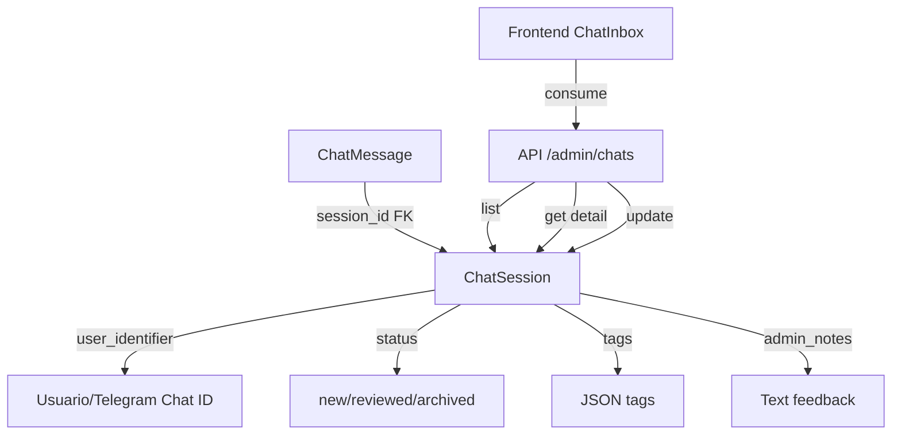

<!-- NG-HEADER: Nombre de archivo: CHAT_MEMORY_PLAN.md -->
<!-- NG-HEADER: Ubicación: docs/CHAT_MEMORY_PLAN.md -->
<!-- NG-HEADER: Descripción: Plan de implementación de sistema de memoria y sesiones persistentes para el chatbot -->
<!-- NG-HEADER: Lineamientos: Ver AGENTS.md -->

# Plan de Memoria y Aprendizaje del Chatbot - Fase 1 y 2

## Contexto

El bot "Growen" procesaba mensajes de forma stateless, guardando solo mensajes individuales en `chat_messages` sin una estructura de sesiones persistente. Esto limitaba la capacidad de mantener contexto conversacional y auditar conversaciones para mejorar el bot mediante RLHF (Reinforcement Learning from Human Feedback).

Este documento describe la arquitectura e implementación del sistema de **Sesiones Persistentes** que permite:

1. Mantener el contexto real de la conversación por usuario
2. Auditar y revisar conversaciones desde un Dashboard de Admin (Inbox) para mejorar el bot (RLHF)

## Arquitectura

### Modelo de Datos

### Componentes Principales

#### 1. Base de Datos

**Modelo `ChatSession`** (`db/models.py`):
- `session_id` (PK): Identificador único de sesión (ej: "telegram:12345", "web:abc123")
- `user_identifier`: ID externo del usuario (ej: "12345" para Telegram)
- `status`: Estado de la sesión ('new', 'reviewed', 'archived')
- `tags`: JSON con etiquetas automáticas o manuales
- `admin_notes`: Texto de feedback humano para RLHF
- `created_at`, `last_message_at`, `updated_at`: Timestamps de auditoría

**Modelo `ChatMessage`** (actualizado):
- `session_id`: ForeignKey hacia `ChatSession` (antes era String sin FK)
- `role`: "user", "assistant", "tool", "system"
- `content`: Contenido del mensaje
- `meta`: JSON con metadatos (intent, tokens, tool_name, etc.)

#### 2. Backend API

**Router `services/routers/admin_chat.py`**:
- `GET /admin/chats`: Lista sesiones con paginación y filtros:
  - `status`: Filtrar por estado (new, reviewed, archived)
  - `user_identifier`: Búsqueda parcial por identificador de usuario
  - `date_from`: Filtrar desde fecha (ISO format: YYYY-MM-DD)
  - `date_to`: Filtrar hasta fecha (ISO format: YYYY-MM-DD)
- `GET /admin/chats/{session_id}`: Detalle completo de sesión + mensajes
- `GET /admin/chats/stats`: Métricas agregadas (total sesiones, por status, mensajes, etc.)
- `PATCH /admin/chats/{session_id}`: Actualizar estado, notas o tags (con validación de status)

**Servicio `services/chat/history.py`** (actualizado):
- `get_or_create_session()`: Obtiene o crea una sesión automáticamente
  - Maneja errores de integridad (intentos de creación paralelos)
  - Extrae `user_identifier` del `session_id` si no se proporciona
- `save_message()`: Guarda mensaje y actualiza `last_message_at` de la sesión
  - Acepta `user_identifier` explícito (recomendado)
  - Manejo robusto de errores con logging y reintentos
  - Valida roles de mensaje antes de guardar

**Handler Telegram `services/chat/telegram_handler.py`** (actualizado):
- Usa `session_id = f"telegram:{chat_id}"` para identificar sesiones
- Guarda mensajes de usuario y asistente usando `save_message()`
- Recupera historial conversacional antes de procesar

#### 3. Frontend

**Página `frontend/src/pages/admin/ChatInbox.tsx`**:
- Layout de 2 columnas:
  - **Izquierda**: Lista de conversaciones con filtros por status, paginación
  - **Derecha**: Vista de chat (burbujas) + Panel de acciones (cambiar status, agregar notas)

**Servicio `frontend/src/services/chats.ts`**:
- Funciones HTTP para consumir endpoints de admin
- Tipos TypeScript para sesiones y mensajes

## Flujo de Creación/Actualización de Sesiones

### Telegram

1. Usuario envía mensaje a Telegram bot
2. `telegram_webhook` recibe el mensaje con `chat_id`
3. Se construye `session_id = f"telegram:{chat_id}"`
4. `handle_telegram_message()` llama a `save_message()` con `user_identifier = chat_id`
5. `save_message()` llama internamente a `get_or_create_session()`:
   - Si la sesión existe, la retorna
   - Si no existe, crea nueva sesión con `status="new"` y extrae `user_identifier` del `session_id`
6. Se guarda el mensaje del usuario
7. Se procesa la respuesta
8. Se guarda el mensaje del asistente
9. Se actualiza `last_message_at` y `updated_at` de la sesión

### Web (Endpoint HTTP `/chat`)

1. Usuario envía mensaje vía HTTP
2. Se genera `session_id` estable (basado en `session.id` o hash de IP+user_agent)
3. **Se formatea como `f"web:{session_id}"`** (prefijo obligatorio para identificar sesiones web)
4. Se extrae `user_identifier` desde `session_data.user` (si existe) o del `session_id` sin prefijo
5. Flujo similar a Telegram: `save_message()` → `get_or_create_session()` → guardar mensajes
6. Todos los mensajes se guardan con `user_identifier` explícito

### WebSocket (`/ws`)

1. Usuario establece conexión WebSocket
2. Si existe `sid` en cookies, se forma `session_id = f"web:{sid}"`
3. Si no hay `sid`, se genera hash de `IP+user_agent` y se forma `session_id = f"web:{hash_id}"`
4. Se extrae `user_identifier` desde la sesión autenticada (si existe) o del `session_id` sin prefijo
5. Flujo similar a HTTP: `save_message()` → `get_or_create_session()` → guardar mensajes
6. La función `_persist_chat_history()` pasa `user_identifier` explícitamente a `save_message()`

## Integración con Sistema Existente

### Compatibilidad con Mensajes Existentes

La migración `20250126_add_chat_sessions_table_and_fk`:
1. Crea tabla `chat_sessions`
2. Agrupa mensajes existentes por `session_id` y crea sesiones correspondientes
3. Extrae `user_identifier` del `session_id` (ej: "telegram:12345" → "12345")
4. Convierte `chat_messages.session_id` de String a ForeignKey

### Historial Conversacional

El módulo `services/chat/history.py` mantiene compatibilidad hacia atrás:
- `get_recent_history()` sigue funcionando igual (solo busca por `session_id`)
- `save_message()` ahora crea/actualiza sesiones automáticamente
- Las funciones existentes que llaman a `save_message()` no requieren cambios

## Próximas Fases (RLHF)

### Fase 3 - Etiquetado Automático
- Análisis de sentimiento en mensajes del usuario
- Detección automática de intents problemáticos
- Tags automáticos basados en contenido (ej: "producto_no_encontrado", "precio_alto")

### Fase 4 - Feedback Humano
- Panel de admin permite marcar respuestas como "buena" o "mala"
- Notas estructuradas sobre qué mejorar
- Exportación de conversaciones para análisis externo

### Fase 5 - Aprendizaje Iterativo
- Pipeline que procesa feedback y ajusta prompts
- Métricas de calidad de respuestas por sesión
- Integración con sistema de fine-tuning (futuro)

## Consideraciones Técnicas

### Rendimiento
- Índices en `chat_sessions`: `user_identifier`, `status`, `last_message_at`, `created_at`
- CheckConstraint en `status` para validar valores permitidos (`new`, `reviewed`, `archived`)
- Paginación obligatoria en listado de sesiones (default: 20 por página)
- Carga lazy de mensajes solo cuando se selecciona una sesión
- Búsqueda eficiente por `user_identifier` usando índice (búsqueda parcial con `ILIKE`)

### Seguridad
- Endpoints admin requieren roles `admin` o `colaborador`
- Los mensajes se almacenan sin sanitización (confianza en el sistema)
- `user_identifier` puede contener datos sensibles (ej: Telegram chat_id) - considerar encriptación en futuras fases

### Escalabilidad
- **Política de archivado automático**: Script `scripts/archive_old_chat_sessions.py` archiva sesiones sin actividad después de N días (default: 90)
  - Archiva solo sesiones con status 'new' o 'reviewed'
  - Preserva sesiones con `admin_notes` (marcadas para revisión)
  - Ejecutable manualmente o vía cron job: `python scripts/archive_old_chat_sessions.py --days 90`
  - Soporta `--dry-run` para preview sin cambios
- Los mensajes se relacionan con sesión vía FK con `CASCADE` - eliminar sesión elimina todos sus mensajes
- Endpoint de métricas `/admin/chats/stats` permite monitorear crecimiento de sesiones y mensajes

## Mejoras Implementadas (2025-01-26)

### Correcciones Críticas
- ✅ **Formato de `session_id`**: Todos los endpoints web (`/chat`, `/ws`) ahora usan prefijo `"web:"` consistentemente
- ✅ **`user_identifier` explícito**: Todas las llamadas a `save_message()` pasan `user_identifier` explícitamente
- ✅ **CheckConstraint**: Validación a nivel de BD para valores de `status` permitidos
- ✅ **Índice en `created_at`**: Mejora rendimiento de consultas por fecha

### Mejoras de Funcionalidad
- ✅ **Filtros avanzados**: Búsqueda por `user_identifier` (parcial) y rango de fechas en `GET /admin/chats`
- ✅ **Endpoint de métricas**: `GET /admin/chats/stats` con estadísticas agregadas (total sesiones, por status, mensajes, etc.)
- ✅ **Política de archivado**: Script `scripts/archive_old_chat_sessions.py` para mantener BD limpia
- ✅ **Manejo de errores**: Logging robusto y reintentos en `save_message()` y `get_or_create_session()`

### Pendientes
- ⏸️ Exportación de conversaciones (JSON/CSV) para análisis externo

## Referencias

- `db/models.py`: Definición de modelos `ChatSession` y `ChatMessage`
- `services/routers/admin_chat.py`: Endpoints de administración
- `services/chat/history.py`: Lógica de persistencia
- `services/chat/telegram_handler.py`: Integración con Telegram
- `frontend/src/pages/admin/ChatInbox.tsx`: UI de administración
- `docs/CHAT.md`: Documentación general del chatbot
- `scripts/archive_old_chat_sessions.py`: Script de archivado automático

